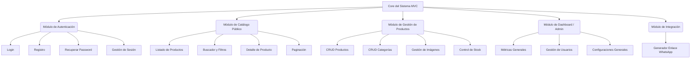

# 5. Diagrama de Módulos
## Sistema de Venta de Ropa al por Mayor

### Estructura Modular Principal

El aplicativo está compuesto por 5 módulos principales altamente cohesivos.

### Descripción de Componentes

1. **Core del Sistema:**
   - Enrutador base.
   - Conexión a Base de Datos (PDO Wrapper).
   - Manejador de Sesiones.
   - Control de Errores y Logging.

2. **Módulo de Autenticación:**
   - Maneja todo el flujo de acceso, seguridad de contraseñas y recuperación. Valida los roles del usuario.

3. **Módulo de Catálogo Público:**
   - Es la cara visible para el cliente y visitantes. Optimizado para la visualización de imágenes y búsqueda rápida.

4. **Módulo de Gestión de Productos (Backend):**
   - Panel de uso exclusivo para Operadores y Administradores. Permite mantener el catálogo actualizado y gestionar el almacenamiento de imágenes locales de los productos.

5. **Módulo de Dashboard / Admin:**
   - Resumen gerencial para el Administrador y gestión de acceso para el personal.

6. **Módulo de Integración:**
   - Construye dinámicamente las URIs de WhatsApp basado en los datos del producto actual y la configuración del número del vendedor.
