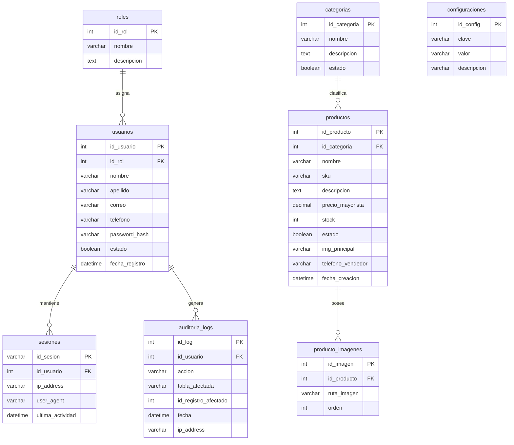

# 7. Modelo Entidad-Relación (ERD)
## Sistema de Venta de Ropa al por Mayor

A continuación se presenta el modelo relacional de la base de datos `db_ropa_mayorista`.

### Notas del Modelo
- Las relaciones son de integridad referencial dura (InnoDB) para evitar registros huérfanos.
- El campo `telefono_vendedor` en la tabla `productos` permite que diferentes productos puedan derivar a diferentes números de WhatsApp si fuese necesario. Si todos derivan al mismo, puede usarse la tabla `configuraciones`.
